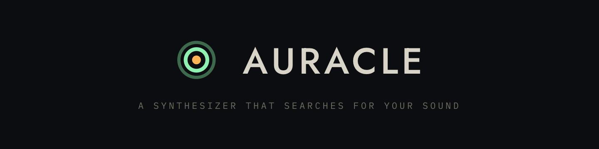
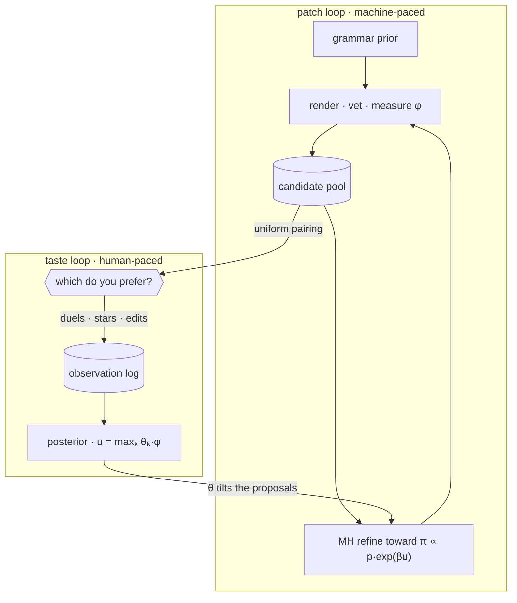

<div align="center">



*Built on [fugue-evo](https://github.com/alexnodeland/fugue-evo) (evolution as
Bayesian inference) and [quiver](https://github.com/alexnodeland/quiver)
(patch-graph DSP).*

<!-- One rule, so the row reads as one object rather than six: green belongs to
     GitHub, amber belongs to us. The two workflow badges are GitHub's own and
     go red when a check fails, which is the whole point of them — nothing here
     may override that. Everything else is a fact this README asserts, and is
     amber on the rack's panel colour. No third colour. -->

[](https://github.com/alexnodeland/auracle/releases/latest)
[](https://github.com/alexnodeland/auracle/actions/workflows/ci.yml)
[](https://alexnodeland.github.io/auracle/)
[](https://alexnodeland.github.io/auracle/docs/)
[](LICENSE)
[](https://www.rust-lang.org/)

</div>

Auracle is a playable modular synthesizer that **models your taste over time**.
It generates patches by evolutionary search, collects your feedback on what it
plays (A/B duels, star ratings, your own hand edits) and fits a persistent
Bayesian model of what you like. Evolution then *proposes toward
you*: the fitted taste posterior reshapes the grammar's own proposal
distribution. Over a session it stops guessing and starts proposing, and it can
show you what it learned.

## Table of Contents

- [Project Status](#-project-status)
- [Why Auracle?](#-why-auracle)
- [Features](#-features)
- [Architecture](#-architecture)
- [Quick Start](#-quick-start)
- [Documentation](#-documentation)
- [Development](#-development)
- [Contributing](#-contributing)
- [License](#-license)

## 🚧 Project Status

Auracle is **pre-1.0 and under active development**. The live site at
[alexnodeland.github.io/auracle](https://alexnodeland.github.io/auracle/)
always tracks `main` — landing page, the playable instrument at
[`/play/`](https://alexnodeland.github.io/auracle/play/), the
[user guide](https://alexnodeland.github.io/auracle/docs/) and the
[technical reference](https://alexnodeland.github.io/auracle/reference/). You can
also build and run it locally. The instrument is fully playable and the taste
loop is closed, but the public API and the save format may change between
commits without notice.

## 🤔 Why Auracle?

Sound design tools make you choose between exploring (presets and randomizers,
fast but shallow) and constructing (patching from scratch, deep but slow).
Genetic-algorithm synths tried to bridge this with star-a-generation workflows,
but they forget everything between sessions and can't tell you *why* they
suggest what they suggest.

Auracle treats the problem as inference:

| Idea | What it buys |
|---|---|
| Patches are **terms in a typed PCFG** over quiver combinators | Every sample, mutation, and hand edit is a valid, playable patch by construction |
| Evolution is **typed MH toward a Boltzmann target** `π(x) ∝ p_grammar(x) · exp(β·u(x))` via fugue-evo | Parsimony comes from the prior, search intensity is one dial, and locked knobs give *exact* conditional refinement |
| Taste is a **max-of-linear-experts utility with its own posterior** | One user can love several unrelated islands of sound; the model names them, shows its confidence, and forecasts your votes |
| The instrument and the search **share one compiler** | What you play live is the same patch that was evolved, vetted, and featurized |

## ✨ Features

- **A real instrument** — 4-voice polyphony in an AudioWorklet, on-screen and
  computer-key keyboards, Web MIDI (velocity, pitch bend, sustain), sample-
  accurate arpeggiator, glide, unison, per-patch loudness normalization, WAV
  recording of your playing, and click-free patch swaps that keep held chords
  alive.
- **A live rack** — every knob is a trace address; turning one writes the
  running voices' atomics (no recompile) *and* the genome. Rewire by dragging
  typed jacks; structural edits are grammar operations, so an edit always
  leaves a playable patch. Undo/redo, per-knob and per-module locks.
- **Forty-one modules** — six sources (a wavetable, a physically-modelled
  pluck and a formant oscillator among them), twenty processors, and fifteen
  modulators. Six processors are **binary**: a crossfade and a ring modulator
  that merge two chains into one, and a compressor, ducker, gate and vocoder
  whose second input is a *control* — real sidechaining, in a typed tree.
  Nearly all of them carry a modulation slot with a named destination,
  including the oscillators, whose slot bends pitch.
- **Modulation is a whole chain** — a cable can carry `s&h rand → quantize →
  slew` before it reaches a cutoff, with a depth bound so the grammar's
  parsimony pressure still applies. The node bank shows what each module does
  to a signal, where it can legally go, and, only where the evidence supports
  it, what the model has learned about it.
- **A taste model that earns trust** — Bradley–Terry duels and ordinal stars
  feed one max-of-experts posterior (fitted style count grows with evidence).
  It forecasts each duel *before* your vote and shows its running calibration;
  styles are nameable and color-coded everywhere; old votes fade with a recency
  half-life. A keep/kill likelihood is fitted too, though no screen emits one
  yet.
- **Taste-directed evolution** — refinement warm-starts typed MH from your best
  patches and takes a short *local* walk on the Boltzmann target (the pool is
  moved uphill on `π_β`, not sampled from it), with kind-proposal weights
  tilted by the structural taste posterior. Lock what you love and evolution
  leaves it alone.
- **Persistence by default** — the whole session (bank, names, taste log,
  lineage, style names) autosaves to IndexedDB; profiles and single patches
  export as shareable files.

## 🏗 Architecture

Two loops around one observation stream, running at different speeds. The
machine-paced one evaluates thousands of candidates against what it has learned
about you and surfaces a curated few; the human-paced one advances only when you
answer something.



The [reference](https://alexnodeland.github.io/auracle/reference/architecture/two-loops.html)
takes both apart.

| Crate | Role |
|---|---|
| `auracle-grammar` | Typed PCFG over quiver combinator terms; term ⇄ trace codec; term → `Patch` compiler with live parameter handles; structural edit ops; presets |
| `auracle-features` | Deterministic phrase rendering, vet gate, BS.1770 LUFS normalization, audio + structural features (φ) |
| `auracle-taste` | Max-of-experts utility, three likelihoods, recency weighting, MCMC posterior, label alignment, portable profiles |
| `auracle-session` | Two-loop engine: pool, duel acquisition (uniform by default; BALD selectable), locked refinement, taste-tilted proposals, session persistence |
| `auracle-wasm` | `WasmEngine` (worker-side brain) and `LivePoly` (worklet-side instrument) |
| `apps/web` | The instrument: PLAY / EVOLVE / TASTE, patch bank, keyboard dock |

## 🚀 Quick Start

**Play it in the browser: https://alexnodeland.github.io/auracle/play/** — every
push to `main` builds the wasm engine and deploys the instrument to GitHub
Pages, and so does every tagged release. Nothing to install; your bank and
taste model live in your browser.

Prefer to run it yourself with no toolchain? Every
[release](https://github.com/alexnodeland/auracle/releases) attaches a
prebuilt web bundle: unzip it, `python3 serve.py`, open the URL.

To build it yourself, Auracle's foundations
([`quiver-dsp`](https://crates.io/crates/quiver-dsp),
[`fugue-ppl`](https://crates.io/crates/fugue-ppl),
[`fugue-evo`](https://crates.io/crates/fugue-evo)) come from crates.io:

```bash
git clone https://github.com/alexnodeland/auracle.git
cd auracle
```

Build and run the instrument:

```bash
make wasm    # wasm-pack build → apps/web/pkg (uses rustup's toolchain)
make serve   # no-store static server on http://localhost:8642
```

Open http://localhost:8642, wait for the pool to warm up, and play
(`a w s e d f t g y h u j …`, or plug in a MIDI keyboard). Press `?` in the app
for the full key map and gesture guide.

## 📚 Documentation

Two books, published as part of the site and built from `www/`:

- **[User Guide](https://alexnodeland.github.io/auracle/docs/)** — playing it.
  The three views, teaching it your taste, reading what it learned, the full
  key map, accessibility, troubleshooting. Start at [Your first
  session](https://alexnodeland.github.io/auracle/docs/getting-started/first-session.html).
- **[Reference](https://alexnodeland.github.io/auracle/reference/)** — how it
  works, with the math. The typed PCFG, the audition pipeline, φ, the
  max-of-experts posterior, the search, the safety layers. It also holds the
  [design](https://alexnodeland.github.io/auracle/reference/design/decisions.html)
  — the decisions log, the milestones and the open questions — so that a
  choice and the maths it justifies are never two documents that can disagree.
  Plus [rustdoc for every
  crate](https://alexnodeland.github.io/auracle/reference/api/auracle_session/index.html).

In the repo:

- [`CONTRIBUTING.md`](./CONTRIBUTING.md) — working *on* Auracle: layout,
  workflow, quality bar, sharp edges, cutting a release.
- [`www/README.md`](./www/README.md) — how the site is assembled, and the
  things about it that fail quietly.
- [`www/brand/`](./www/brand/) — the mark, the lockups and the icon set, with
  the [full spec](https://alexnodeland.github.io/auracle/brand/) at `/brand/`.
  Read it before drawing anything.
- [`apps/web/README.md`](./apps/web/README.md) — the web app's architecture
  (worklet assembly, worker protocol, workbench).
- [`CHANGELOG.md`](./CHANGELOG.md) — notable changes by pass.

## 🛠 Development

```bash
make check   # fmt-check + clippy (-D warnings) + tests — the CI gate
make test    # cargo test --workspace --release (DSP tests need release)
make fmt     # rustfmt
make lint    # clippy
```

The site:

```bash
make site-tools   # install the pinned doc toolchain (once)
make site         # build all four sections into site/
make site-serve   # http://localhost:8643
make site-check   # every link, asset and anchor must resolve
```

See [`CONTRIBUTING.md`](./CONTRIBUTING.md) for the full guide and
[`www/README.md`](./www/README.md) for the site.

## 🤝 Contributing

Contributions are welcome — see [`CONTRIBUTING.md`](./CONTRIBUTING.md). Run
`make check` before opening a PR.

## 📄 License

MIT — see [LICENSE](./LICENSE).

© 2026 [Alex Nodeland](https://alexnodeland.com).
