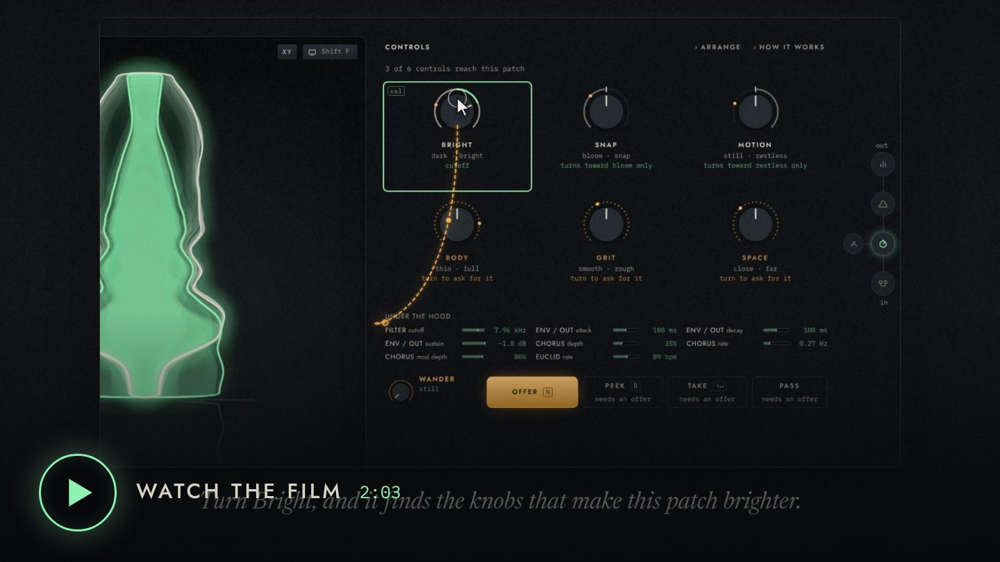
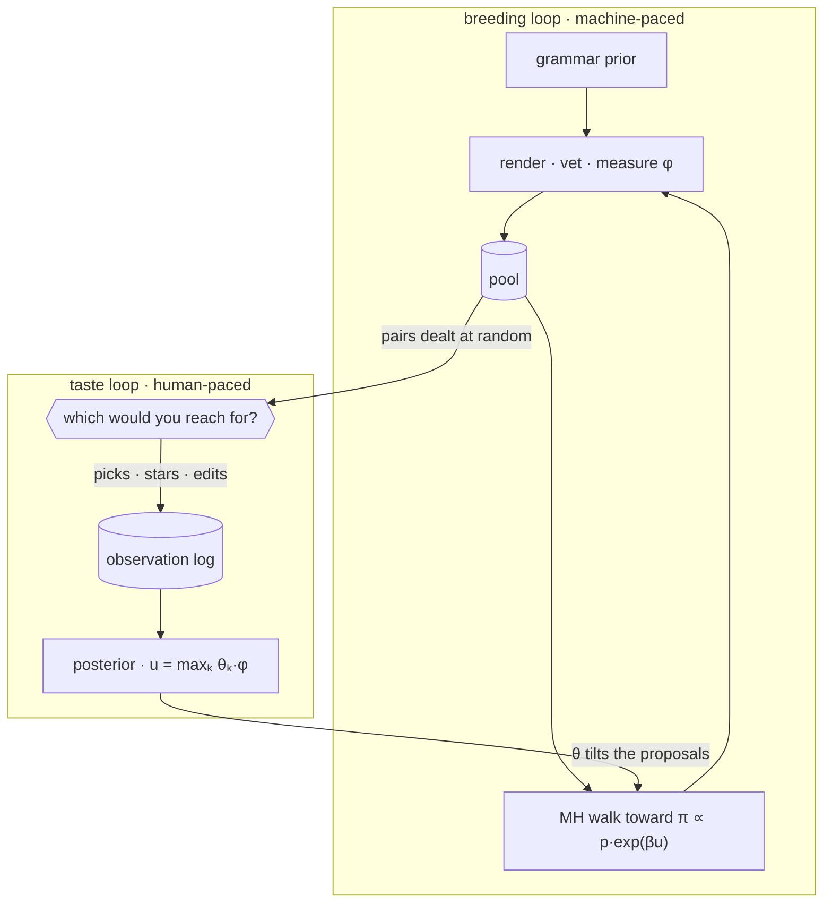

<div align="center">


Pick the sound you’d reach for. It learns your ear, and every generation grows
a little closer.

[](https://github.com/alexnodeland/auracle/actions/workflows/ci.yml)

</div>

Auracle is a modular synthesizer you play in the browser. Pick between two
sounds, and it learns what you like, breeds new sounds toward it, and shows you
what it learned. Every sound is a patch you can open and change.

<!-- films:readme -->
<a href="https://auracle.alexnodeland.com/"></a>

**[▶ Watch the launch film](https://auracle.alexnodeland.com/)** (1:38) · [How Auracle learns what you like](https://auracle.alexnodeland.com/docs/films.html#film-taste) (1:49) · [Under the hood](https://auracle.alexnodeland.com/docs/films.html#film-engine) (2:17) · [The math](https://auracle.alexnodeland.com/docs/films.html#film-math) (2:46) · [The sound engine](https://auracle.alexnodeland.com/docs/films.html#film-dsp) (2:49)
<!-- /films:readme -->

## Play it

**In your browser: <https://auracle.alexnodeland.com/play/>.** It is free, with
no account and nothing to install, and your sounds and your taste stay in your
browser. Every push to `main` rebuilds the engine and redeploys it.

**Offline:** every [release](https://github.com/alexnodeland/auracle/releases)
comes with a ready-built web bundle. Unzip it, run `python3 serve.py`, and open
the address it prints. No Rust needed.

## Run it locally

You need [rustup](https://rustup.rs/) and Node 22, the version in
`.node-version`.

```bash
git clone https://github.com/alexnodeland/auracle.git && cd auracle
make setup   # the wasm target, wasm-pack, the test browser and git hooks, then the engine
make serve   # http://localhost:8642
```

`make setup` is idempotent: run it again after pulling. Open
<http://localhost:8642>, let the pool fill, and play from your computer keys
(`a w s e d f t g y h u j …`), a MIDI keyboard, or the keys on screen. Press
<kbd>?</kbd> in the app for the key map and gestures.

## Read more

- **[The guide](https://auracle.alexnodeland.com/docs/)**: playing it. The four
  views, teaching it your taste, reading what it learned, the key map,
  accessibility, and troubleshooting. Start at
  [your first session](https://auracle.alexnodeland.com/docs/getting-started/first-session.html).
- **[The reference](https://auracle.alexnodeland.com/reference/)**: how it
  works, with the math. The grammar, the audition, the features, the taste
  model, the search, and the safety layers, with the
  [design decisions](https://auracle.alexnodeland.com/reference/design/decisions.html)
  and [rustdoc for every crate](https://auracle.alexnodeland.com/reference/api/auracle_session/index.html).
- **[`docs/`](./docs/README.md)**: for contributors. Architecture notes,
  decisions (ADRs), proposals, plans, and runbooks.

## What it does

Sound design usually means a choice. Presets are fast, and nothing you hear
today helps tomorrow. Patching from scratch goes deep, slowly. Auracle grows:
it keeps what you teach it, across sessions, and breeds toward it.

| Idea | What it gives you |
| --- | --- |
| Every sound is a **term in a typed grammar** (a probabilistic context-free grammar over [quiver](https://github.com/alexnodeland/quiver) modules) | Every sample, mutation, and hand edit is a valid, playable patch by construction |
| Breeding is **typed Metropolis–Hastings toward a Boltzmann target**, `π(x) ∝ p_grammar(x) · exp(β·u(x))`, through [fugue-evo](https://github.com/alexnodeland/fugue-evo) | The grammar supplies parsimony, your taste supplies direction, β is one dial between them, and locked knobs give *exact* conditional refinement |
| Taste is a **max of linear experts, with its own posterior** | One player can love several unrelated kinds of sound; the model names them as styles, shows how sure it is, and guesses each pick before you make it |
| The instrument and the search **share one compiler** | What you play is the same patch that was bred, vetted, and measured |

### The instrument

- **Play it.** Four voices of polyphony in an AudioWorklet; your computer keys,
  the keys on screen, or Web MIDI (velocity, pitch bend, sustain); an
  arpeggiator, glide, and unison; every sound loudness-normalized; WAV
  recording of your playing; and sound changes that keep held chords ringing.
- **Open it.** Every knob is a trace address. Turning one writes the running
  voices' parameters (no recompile) and the genome. Rewire by dragging typed
  jacks; a structural edit is a grammar operation, so an edit always leaves a
  playable patch. Undo and redo, and locks per knob and per module.
- **Forty-five modules.** Seven sources (a wavetable, a physically modeled
  pluck, a formant oscillator, and AUDIO IN, your own input, among them),
  twenty-two processors (CAPTURE, which records into the sound, among them),
  and sixteen modulators. Seven processors take two inputs: a mix and a ring
  modulator that merge two chains into one; a compressor, ducker, gate, and
  vocoder whose second input is a *control*, so sidechaining lives in a typed
  tree; and TRACK, which plays its first chain from the pitch of its second. Nearly
  all of them carry a modulation slot with a named destination, the oscillators
  included, where it bends pitch.
- **Modulation chains.** A cable can carry `s&h rand → quantize → slew` before
  it reaches a cutoff, with a depth bound so the grammar's parsimony still
  applies. The module rail shows what each module does to a signal, where it can
  go, and, only where the evidence supports it, what the model has learned
  about it.

### The model

- **It learns from picks, stars, and edits.** Bradley–Terry picks and ordinal
  stars feed one max-of-experts posterior, whose number of styles grows with
  the evidence. It guesses each pick before you make it and shows how often it
  was right; styles can be named, and keep their color everywhere; older picks
  fade with a recency half-life. A keep/kill likelihood is fitted too: a cut in
  the bank records a kill once its undo window closes.
- **It breeds toward your taste.** EVOLVE POOL runs one generation: a short
  local Metropolis–Hastings walk from each of the sounds it rates highest, on
  the Boltzmann target (the pool moves uphill on `π_β`; it is not sampled from
  it), with the grammar's proposal weights tilted by what it has learned about
  structure. Lock what you love in PATCH, and ⚡ EVOLVE FROM THIS walks
  everything else.
- **It keeps your session.** The whole session (the bank, names, the taste log,
  lineage, and style names) saves itself to IndexedDB. Taste profiles and
  single patches download as files you can share.

## How it fits together

Two loops share one record of what you taught it. The breeding loop runs when
you press EVOLVE POOL: each generation renders and rates hundreds of candidate
sounds against what the model has learned, with no one listening, and keeps
only the few that earn a place in the pool. The taste loop moves only when you
pick.


```mermaid
flowchart TD
    subgraph patch["breeding loop · machine-paced"]
        prior["grammar prior"]
        vet["render · vet · measure φ"]
        pool[("pool")]
        refine["MH walk toward π ∝ p·exp(βu)"]
        prior --> vet
        vet --> pool
        pool --> refine
        refine --> vet
    end

    subgraph taste["taste loop · human-paced"]
        pair{{"which would you reach for?"}}
        log[("observation log")]
        post["posterior · u = maxₖ θₖ·φ"]
        pair -->|"picks · stars · edits"| log
        log --> post
    end

    pool -->|"pairs dealt at random"| pair
    post -->|"θ tilts the proposals"| refine
```

The [reference](https://auracle.alexnodeland.com/reference/architecture/two-loops.html)
takes both apart.

| Crate | Role |
| --- | --- |
| `auracle-grammar` | The typed grammar over quiver combinator terms; the term ⇄ trace codec; the term → `Patch` compiler with live parameter handles; structural edit operations; presets |
| `auracle-features` | Deterministic phrase rendering, the vetting gate, BS.1770 LUFS normalization, and the audio and structural features (φ) |
| `auracle-taste` | The max-of-experts utility, three likelihoods, recency weighting, the MCMC posterior, label alignment, and portable profiles |
| `auracle-session` | The two-loop engine: the pool, dealing pairs (at random by default; BALD selectable), locked refinement, taste-tilted proposals, and session persistence |
| `auracle-wasm` | `WasmEngine` (the worker's engine) and `LivePoly` (the worklet's instrument) |
| `apps/web` | The instrument: PERFORM, PATCH, EVOLVE, TASTE and LEARNING as levels of one space, the bank, the keyboard dock, and MIDI |

Auracle builds on [`quiver-dsp`](https://crates.io/crates/quiver-dsp)
(patch-graph DSP), [`fugue-ppl`](https://crates.io/crates/fugue-ppl), and
[`fugue-evo`](https://crates.io/crates/fugue-evo) (evolution as Bayesian
inference), all from crates.io.

While the version is 0.x, the public API and the save format may change between
commits. Sessions written by older builds are migrated on load, but migrations
are code: **⋯ → Download your taste** before updating is the only backup there
is. See [Your data](https://auracle.alexnodeland.com/docs/your-data.html).

## Development

```bash
make check   # the CI gate: fmt-check, clippy (-D warnings), app syntax, dev-check, wasm32, and the tests
make test    # cargo test --workspace --profile test-fast (the DSP tests need optimized code)
make fmt     # rustfmt
make lint    # clippy
make help    # every target, with what it does
```

The site:

```bash
make site-tools   # install the pinned doc toolchain, once
make site         # build all four sections into site/
make site-serve   # http://localhost:8643
make site-check   # every link, asset, and anchor must resolve
```

`make film-setup` adds what the films need: the voice's Python environment and
models, the film tools, and the shared sound.

In the repo:

- [`CONTRIBUTING.md`](./CONTRIBUTING.md): working *on* Auracle. The layout,
  the workflow, the quality bar, the sharp edges, and cutting a release.
- [`AGENTS.md`](./AGENTS.md): the working rules for coding agents and people,
  one file per area of the repo, each linking deeper.
- [`www/README.md`](./www/README.md): how the site is assembled, and the
  things about it that fail quietly.
- [`www/brand/`](./www/brand/): the mark, the lockups, the icon set, and
  [`voice.md`](./www/brand/voice.md), the rules for every word Auracle says.
  The [full spec](https://auracle.alexnodeland.com/brand/) is at `/brand/`.
- [`apps/web/README.md`](./apps/web/README.md): the web app's architecture
  (the worklet, the worker protocol, the node bank) and its design system.
- [`www/video/README.md`](./www/video/README.md): how the films are made, from
  script to site, with every tool.
- [`CHANGELOG.md`](./CHANGELOG.md): what changed, release by release.

## Contributing

Contributions are welcome: see [`CONTRIBUTING.md`](./CONTRIBUTING.md), and run
`make check` before opening a pull request.

## License

MIT; see [LICENSE](./LICENSE).

© 2026 [Alex Nodeland](https://alexnodeland.com).
